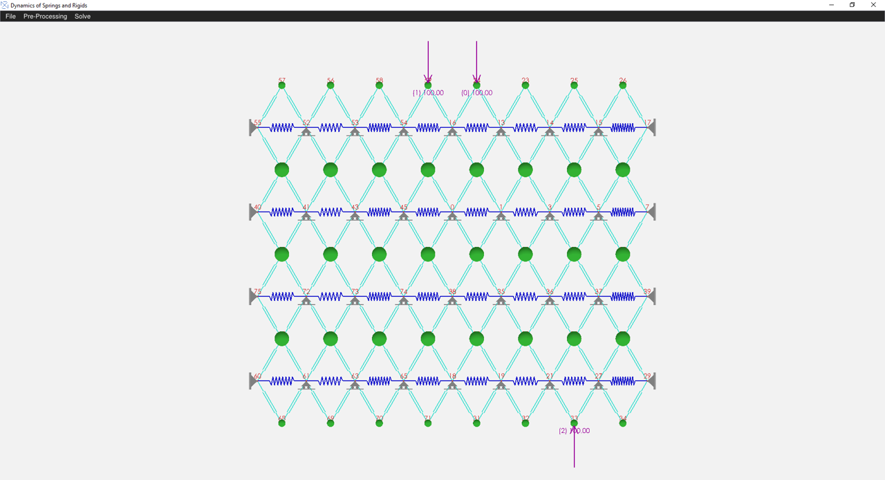
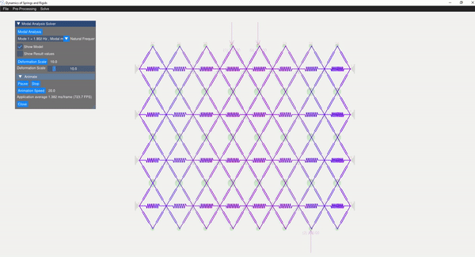
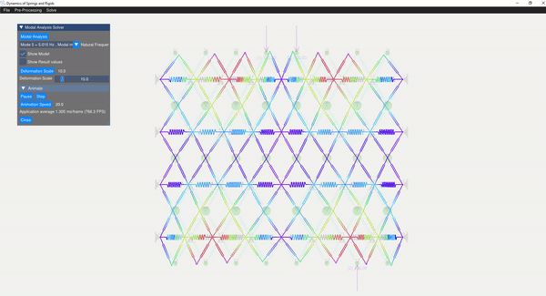
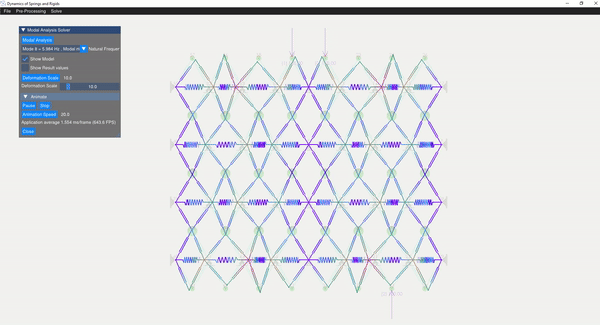
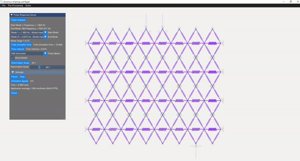

# Dynamics_of_Springs_and_Rigids

## Table of Contents

- [Introduction](#introduction)
- [Features](#features)
- [Installation](#installation)
- [Usage](#usage)
- [Model Visualization](#model-visualization)
- [Modal Analysis](#modal-analysis)
- [Pulse Analysis Solver](#pulse-analysis-solver)
- [Forced Response Analysis](#forced-response-analysis)
- [Conclusion](#conclusion)
- [Dependencies](#dependencies)
- [Contributing](#contributing)
- [License](#license)

## Introduction

This project focuses on simulating the dynamics of a system comprising springs and rigid elements with multi 2D degrees of freedom. The C++ application is capable of importing plane truss models from varai2D, raw text files, and AutoCAD DXF files. It facilitates various pre-processing tasks, such as applying boundary conditions, adding point masses, applying initial conditions, and applying point loads. The modal analysis eigenvalue problem is solved for the mass/stiffness matrix, utilizing a semi-analytical method to address pulse loads, harmonic loads, and forced vibration responses. The tool employs C++17 and OpenGL 3.3 for rendering the models and analysis results.

## Features

- Model import from varai2D, raw text files, and AutoCAD DXF files
- Pre-processing tasks: boundary conditions, point masses, initial conditions, and point loads
- Modal analysis for mode shapes and natural frequencies
- Pulse analysis solver for semi-analytical dynamic system response
- Forced response analysis for specific nodes and various frequencies

## Installation

1. Clone the repository: `git clone https://github.com/Samson-Mano/Dynamics_of_Springs_and_Rigids.git`
2. Navigate to the project directory: `cd Dynamics_of_Springs_and_Rigids`
3. Compile the project using your C++17 compiler: `g++ -std=c++17 -o Dynamics_of_Springs_and_Rigids/main.cpp`
4. Run the compiled executable: `./Dynamics_of_Springs_and_Rigids`

## Usage

1. Prepare your 2D spring/rigid model description in varai2D, a text file, or DXF format.
2. Run the executable and follow the on-screen instructions to import the model.
3. Apply boundary conditions, point masses, point loads, and initial conditions as needed.
4. Perform modal analysis to calculate mode shapes and natural frequencies.
5. Simulate the pulse response using modal superposition.
6. Visualize the results using the built-in OpenGL renderer.

## Model Visualization

Geometry can be imported through AutoCAD DXF format, varai2D format, or raw text format. Element properties can be adjusted by selecting the elements, and point masses can be added to nodes. Point loads and initial conditions can also be applied to the nodes.

  
*Model view*

## Modal Analysis

The eigenvalue problem of the mass-stiffness characteristics matrix is solved using the C++ eigen function. The mode shapes can be verified with the GUI displaying the mode shapes.

### Modes

| Mode 1 | Mode 5 |
|--------|--------|
|  |  |

| Mode 8 | Mode 14 |
|--------|--------|
|  |  |

## Pulse Analysis Solver

A semi-analytical method using modal superposition is employed to solve for the response of the dynamic system. Appropriate mode shapes are selected for this analysis, allowing the user to discard rigid modes. Various pulse responses are visualized, including:

- Half sine pulse
- Triangular pulse
- Rectangular pulse
- Step force with finite rise
- Harmonic force

  
*(Image showing the pulse analysis result)*

## Forced Response Analysis

Forced response analysis displays the response of a particular node for various frequencies. This illustrates the modal contribution and resonance frequencies for a specific node.

## Conclusion

This project is an experimental endeavor aimed at improving the semi-analytical method for solving dynamical systems for shock responses.

## Dependencies

- C++17 Compiler
- OpenGL 3.3
- Third-party libraries (if any)

## Contributing

Contributions are welcome! If you find any issues or have suggestions for improvements, please open an issue or submit a pull request.

## License

This project is licensed under the MIT License - see the [LICENSE](LICENSE) file for details.
